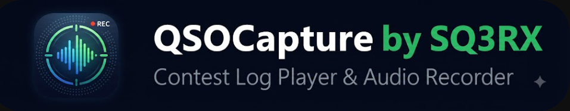
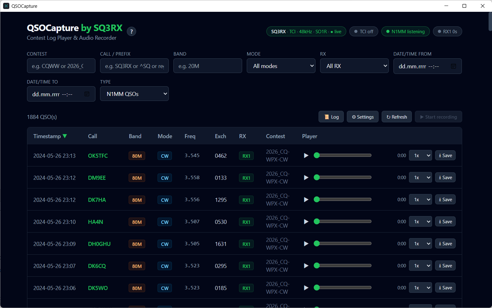
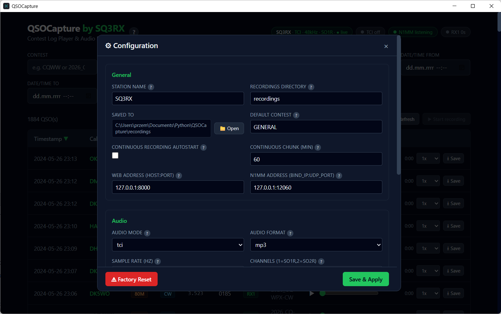
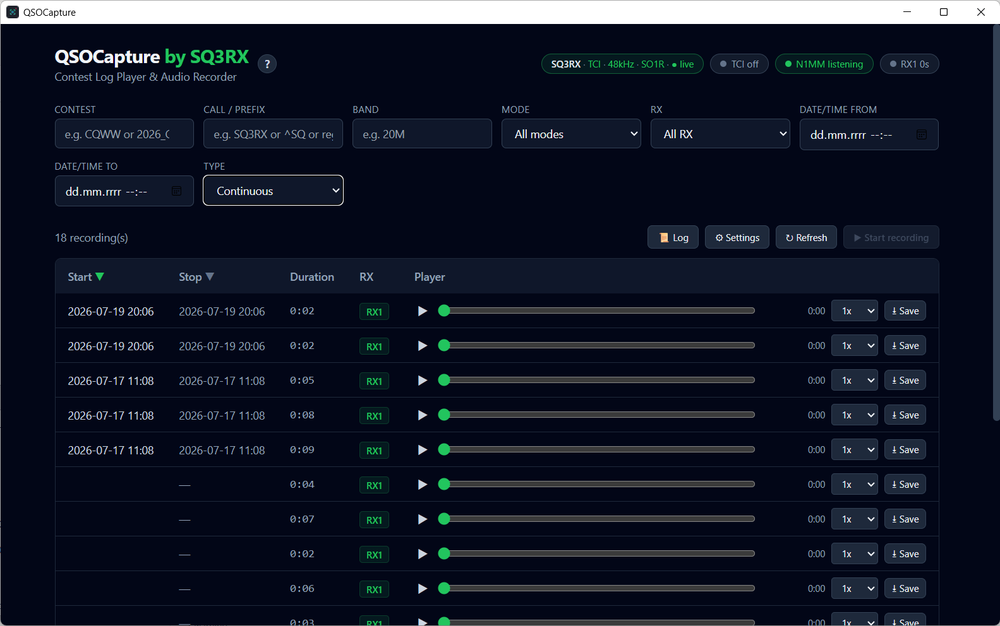
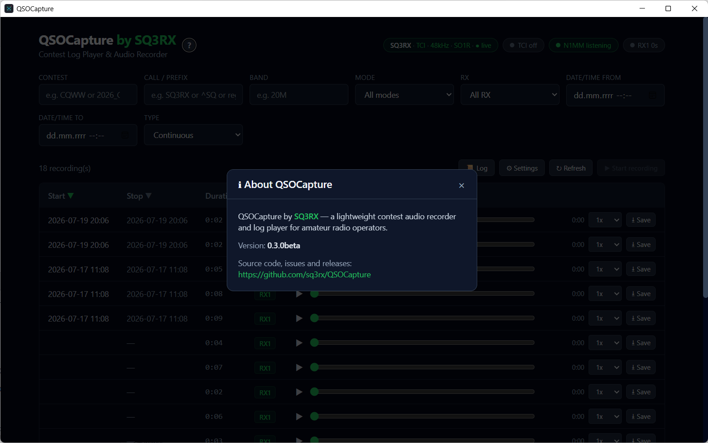
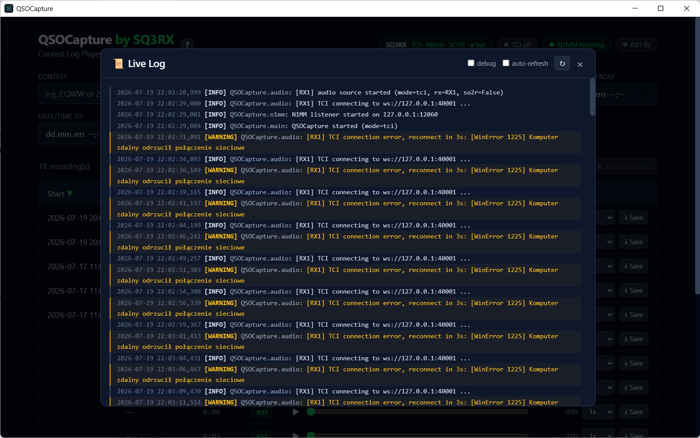

# QSOCapture by SQ3RX

<p align="center">
  
</p>

[](https://github.com/sq3rx/QSOCapture/actions/workflows/main.yml)
[](LICENSE)
[](https://www.python.org)

**Version:** 0.7.0beta

**QSOCapture** is a lightweight contest audio recorder and log player for
amateur radio operators. It captures audio from your receiver (via the
**TCI** protocol from ExpertSDR or a regular **soundcard** input), slices out
each QSO the moment **N1MM Logger+** or **N3FJP software** logs it, and
presents everything in a clean, color-coded web dashboard.

---

## Table of Contents

- [Features](#features)
- [Building](BUILDING.md)
- [Manual (user guide)](MANUAL.md)
- [Screenshots](#screenshots)
- [Project layout](#project-layout)
- [API reference](#api-reference)
- [Troubleshooting](#troubleshooting)
- [Changelog](#changelog)
- [Development approach](#development-approach)
- [License](#license)

---

## Features

 - **Automatic QSO slicing** — listens to N1MM Logger+ UDP broadcasts or the
   N3FJP TCP API and records a few seconds before/after each contact
   (pre-roll / post-roll). Edited/deleted N3FJP QSOs are kept in sync
   automatically via reconciliation.
 - **Continuous recording** — records the whole band into time-sliced chunks
   so no QSO is ever missed. Controlled by the **Continuous recording
   autostart** setting and the dashboard **Start/Stop recording** button.
 - **Two audio sources** — ExpertSDR via the TCI WebSocket protocol, or any
   system soundcard input device.
 - **WAV / MP3 output** — recordings are saved as lossless WAV by default;
   optionally switch to MP3 (via `lameenc`) for smaller files.
  - **SO2R ready** — in stereo (`channels = 2`) the left channel is recorded as
    **RX1** and the right channel as **RX2**, each into its own buffer and its
    own audio file. In mono (SO1R) only RX1 is used.
  - **Dual card SO2R** — instead of a single stereo soundcard, you can use
    **two separate soundcards**, each capturing one receiver in mono. Toggle
    the SO2R mode in Settings → Audio to switch between "Stereo" (one card,
    L→RX1, R→RX2) and "Dual card" (two independent mono devices).
 - **Per-RX buffer badges** — the dashboard header shows a live buffer-fill
   badge for every receiver (`RX1 30s`, `RX2 30s` in SO2R) so you always know
   how much audio is buffered.
 - **Per-RX logging** — pause/resume/start messages and QSO slices are logged
   and stored separately per receiver (`[RX1]`, `[RX2]`).
 - **Web dashboard** — browse, filter and replay recordings from the local
   machine (binds to 127.0.0.1 by default; change `web_host` to `0.0.0.0` in
   settings only if you intentionally want to expose it on the network).
 - **Rich filtering** — by contest, callsign / prefix (supports regex), band,
   mode, **RX (All / RX1 / RX2)**, and an exact date/time range.
 - **Separate views** — N1MM QSOs and Continuous recordings are kept apart,
   each with the columns that matter.
 - **Color-coded log** — the live application log and the QSO table use
   friendly color badges (mode, band, RX) for at-a-glance readability.
 - **Resets and deletes** — reset config, clear QSO log, delete all
     data, delete per-contest (files only or files + QSOs), delete
     continuous recordings by date range, or factory reset everything —
     all from the dashboard.
  - **Desktop app with system tray** — the application runs in its own window
     and can be minimised to the system tray. Click the tray
    icon to restore, or use the tray menu to quit.
  - **Single build for all Windows versions** — no separate legacy build for
    Windows 7/8 is needed.
---

## Building

For system requirements and instructions on building the standalone EXE or
Windows installer, see [BUILDING.md](BUILDING.md).

---

## User manual

A complete user guide covering installation, configuration, all settings,
SO2R setup, filtering, playback, data management, update checking and
troubleshooting is available in [MANUAL.md](MANUAL.md).

---

## Screenshots

A few views of the **QSOCapture** dashboard in action:











---

## Project layout

```
QSOCapture/
├── main.py            # FastAPI app, web dashboard, orchestration (python main.py)
├── qt_launcher.py     # Desktop EXE entry point (PySide6 / Qt WebEngine)
├── config.py          # Config loading/saving + schema (with help text)
├── db.py              # SQLite storage of QSO records
├── audio_manager.py   # Audio capture (TCI / soundcard) + circular buffer
├── n1mm_listener.py   # N1MM Logger+ UDP listener
├── index.html         # Tailwind dashboard (served by main.py)
├── build.spec         # PyInstaller spec for building the standalone EXE
├── installer.iss      # Inno Setup script for the Windows installer
├── BUILDING.md        # Build instructions (requirements, EXE, installer)
├── gen_icon.py        # Icon generator (SVG → ICO)
├── CHANGELOG.md       # Release changelog
├── LICENSE            # MIT license
├── .gitignore
├── requirements.txt
├── screenshots/       # Dashboard screenshots
└── recordings/        # Recorded audio (created on first run)
```

---

## API reference (short)

| Method | Endpoint | Purpose |
| ------ | -------- | ------- |
| GET | `/icon.svg` | QSOCapture SVG logo. |
| GET | `/icon.ico` / `/favicon.ico` | Dashboard favicon. |
| GET | `/` | Serve the web dashboard HTML. |
| GET | `/api/contests` | List contest folders. |
| GET | `/api/qsos` | Filtered QSO list (`contest`, `call`, `band`, `mode`, `rx`, `date_from`, `date_to`, `continuous`, `offset`, `limit`, `sort_by`, `sort_dir`). |
| GET | `/api/status` | TCI / N1MM connection state + per-RX buffer fill. |
| GET | `/api/log` | Recent application log lines (`n`, `debug`). |
| GET | `/api/config` | Current config + UI schema (with help). |
| POST | `/api/config` | Update config live and restart services. |
| POST | `/api/continuous/pause` | Finalise the current continuous chunk and stop recording. |
| POST | `/api/continuous/resume` | Resume continuous recording with a fresh chunk. |
| GET | `/api/export` | Download all (or one contest's) recordings as a ZIP archive. |
| GET | `/api/audio_devices` | List available soundcard input devices. |
| GET | `/api/paths` | Absolute filesystem paths of `recordings/` and `config.cfg`. |
| POST | `/api/open_folder` | Open the recordings directory in the system file manager. |
| GET | `/api/version_check` | Compare running version against latest GitHub release tag. |
| GET | `/api/events` | Server-Sent Events stream for live dashboard updates. |
| POST | `/api/debug` | Enable or disable debug-level logging at runtime. |
| POST | `/api/reset_config` | Restore configuration to defaults. |
| POST | `/api/clear_qsos` | Delete all QSO records from the database. |
| POST | `/api/delete_recordings` | Delete all audio files (keep config and QSO log). |
| POST | `/api/delete_contest` | Delete contest folder + QSO records for a given contest. |
| POST | `/api/delete_contest_recordings` | Delete contest audio files only (QSO records are kept). |
| POST | `/api/delete_continuous` | Delete continuous recordings within a date range. |
| POST | `/api/factory_reset` | Wipe log + recordings + restore defaults. |
| GET | `/audio/{contest}/{file}` | Stream a recorded audio file. |

## Troubleshooting

For detailed troubleshooting guidance covering all common issues, see the
[Troubleshooting section in MANUAL.md](MANUAL.md#12-troubleshooting).

---

## Changelog

For a business-oriented summary of what changed in each release, see
[CHANGELOG.md](CHANGELOG.md).

## License

This project is licensed under the MIT License — see the [LICENSE](LICENSE) file
for details. Free to use, modify and share for amateur radio and beyond.

---

## Development approach

This project was created with an **agentic (AI-assisted) approach** — the code,
structure and documentation were iteratively developed with the help of an AI
coding agent. This workflow keeps the project easy to evolve: new capabilities
can be added by describing the desired behaviour in natural language.

**73 de SQ3RX**
